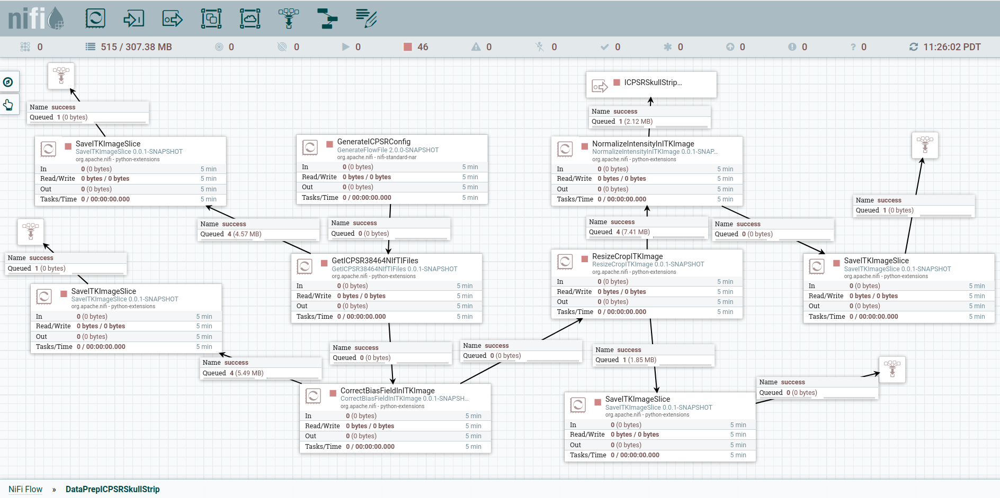

# AI Stroke Diagnosis

SJSU Master Thesis on Deep Learning in AI Medical Imaging for Stroke Diagnosis

## Objective

- Use Apache NiFi and create multiple custom Python Processors to handle data preprocessing for skull stripping segmentation, stroke lesion segmentation and image captioning. My goal here is to make it easier to transition between preprocessing the different datasets we have been working with since we didn't have access to the ICPSR 38464 sroke dataset for a long time, but I think it is important to compare how our Deep Learning models learn from the preprocessed data from the different datasets.

- Use ZeroMQ in Python to send the preprocessed data via a pandas dataframe with the saved file locations from NiFi to the place where we are training the Deep Learning model for skull stripping segmentation, stroke lesion segmentation and image captioning. A custom NiFi Python processor with a ZMQ Publisher will take care of sending the pandas dataframe over and there will be a python script with a ZMQ Subscriber to receive that dataframe and then use the preprocessed data to train the appropriate models.

- Visualize the data as we perform preprocessing to skull stripping segmentation, stroke lesion segmentation and image captioning. Initially we'll use matplotlib and save image files, but I am hoping to integrate in 3D Slicer, so the user can see the telemetry of each stage of our Deep Learning pipeline as well as have a place where the Neuroradiologist can interact with a chatbot (maybe GPT, or another LLM) to get lesion segmentation and image captioning results about the stroke patients.

## NiFi Python Data Preprocessing

NiFi Data Preparation Pipeline for Eventually Training a Skull Stripping Segmentation model (ICPSR, NFBS supported)

- **Figure 1:** NiFi Data Prep for Skull Stripping Segmentation Applied to ICPSR 38464

NiFi Data Preparation Pipeline for Eventually Training a Image Captioning model (Flickr supported, ICPSR in progress)

- **Figure 2:** NiFi Data Prep for Image Captioning Applied to Flickr

- **Figure 2:** NiFi Data Prep for Image Captioning Appling to ICPSR 38464

NiFi Data Preparation Pipeline for Eventually Training a Stroke Lesion Segmentation model (ICPSR in progress, ATLAS in progress)

Coming soon...

Here is my plan:

- Client - Publisher: Simulate Stroke MRI Scanner in Unity where we load the MRI images while running the scanner simulator and then send those images over Zmq using C# Zmq Publisher.
    - First work on a simple Python Zmq publisher to send stroke MRIs to 3D Slicer
    - Second convert Python Zmq publisher to C++.

- Server - Subscriber: "This an AI Stroke Diagnosis 3D Slicer extension using SuperBuild to build a project comprised of multiple modules that doctors and radiologists can leverage to load stroke data over Zmq using Python/C++ Zmq Subscriber, display stroke data dasbhoard analytics with ITK/VTK, display stroke lesion segmentation performed with PyTorch/CUDA's custom UNet model and display stroke medical image captioning performed with PyTorch/CUDA's custom CapGAN (or Transformer, LLM) model."
    - Initially work on simple Python Zmq subscriber in 3D Slicer custom extension.

## Contributors

James Guzman (SJSU MS AI, Medical Imaging), Dr. Magdalini Eirinaki (SJSU MS AI Director & Project Advisor)

